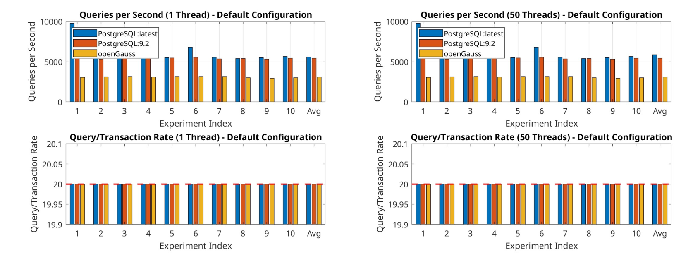
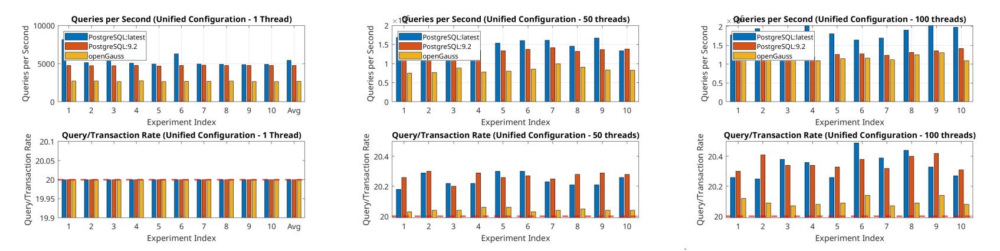
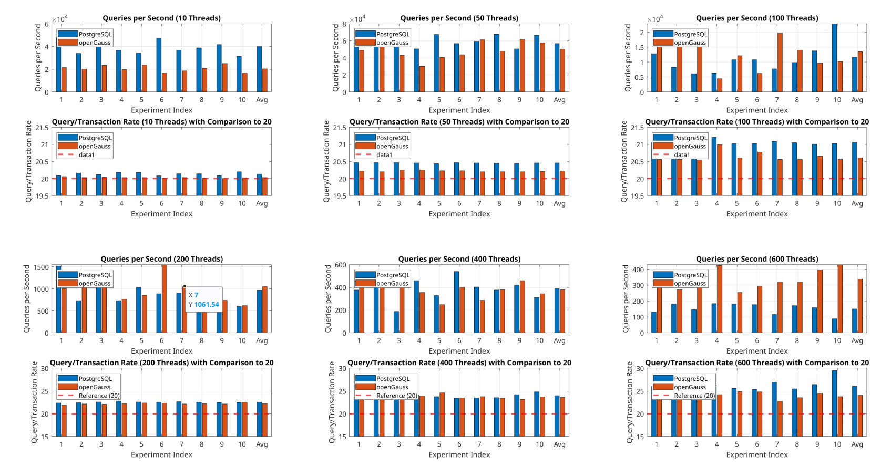
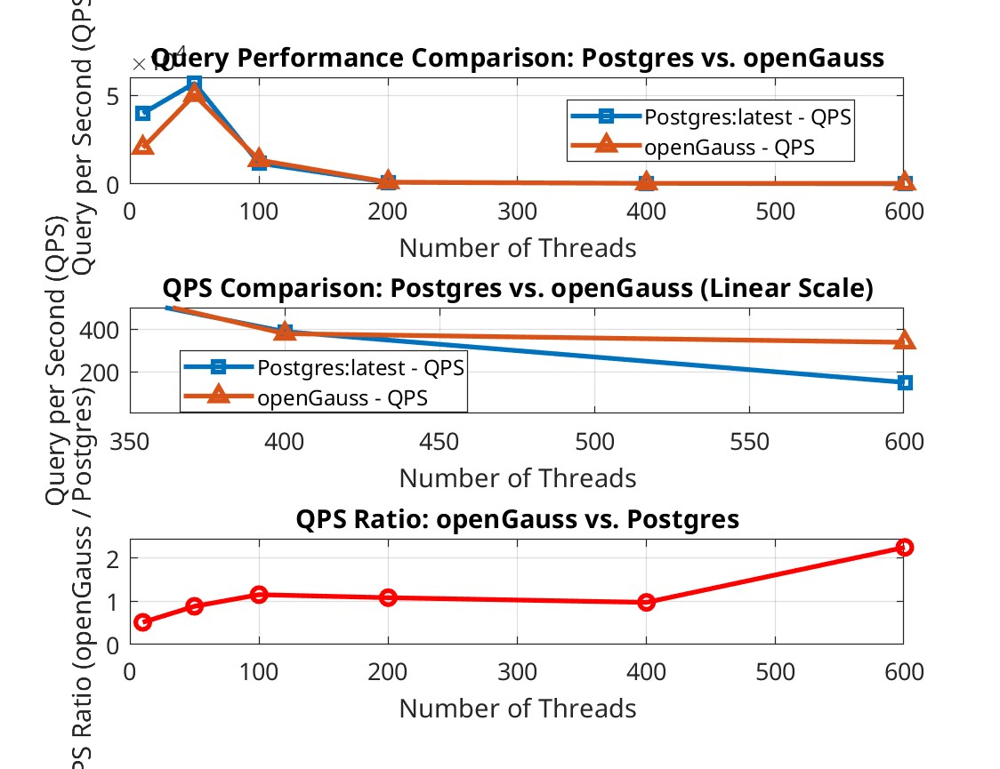
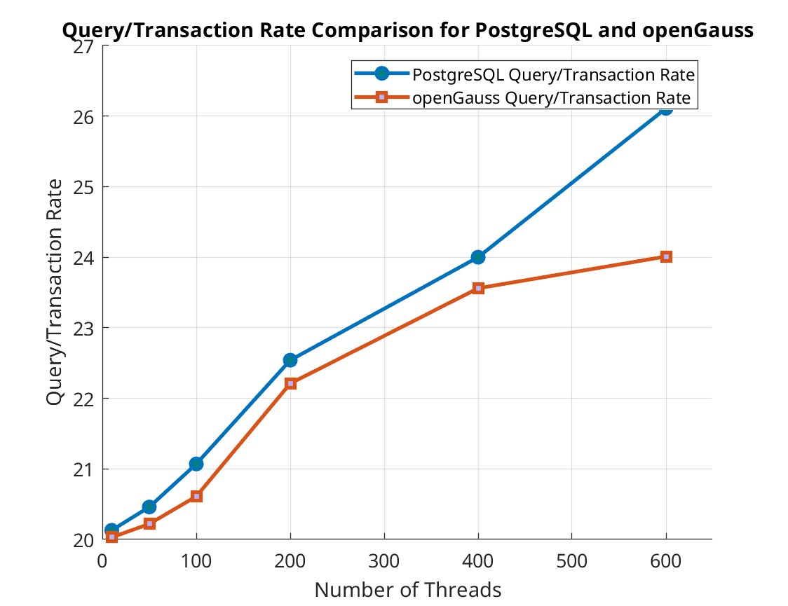
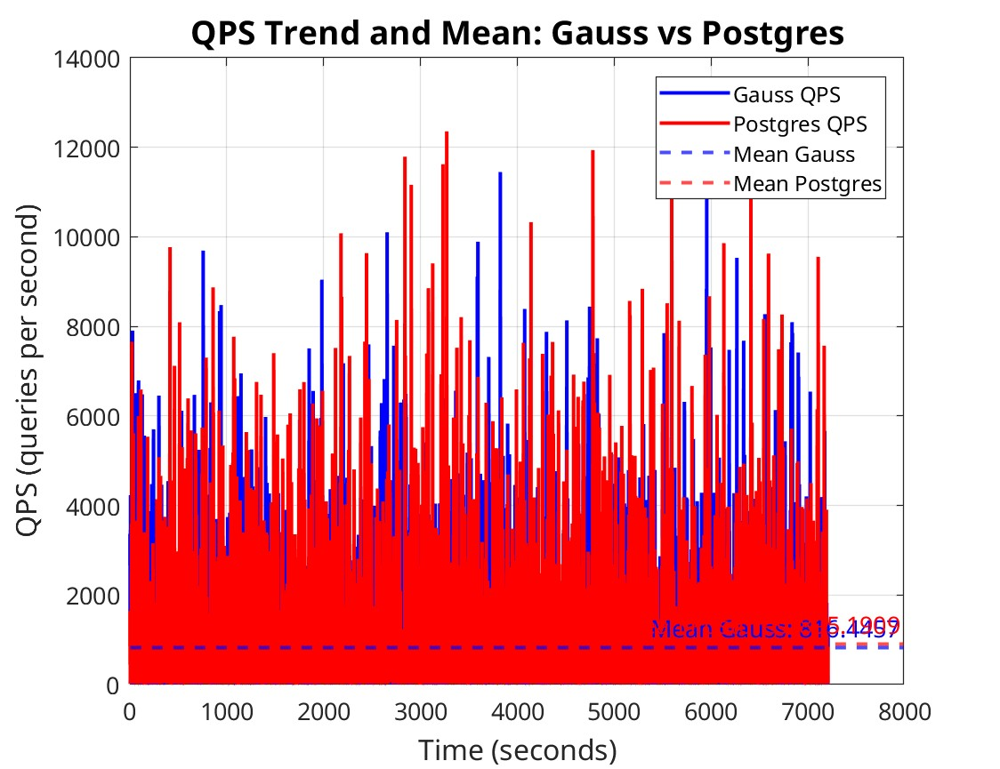
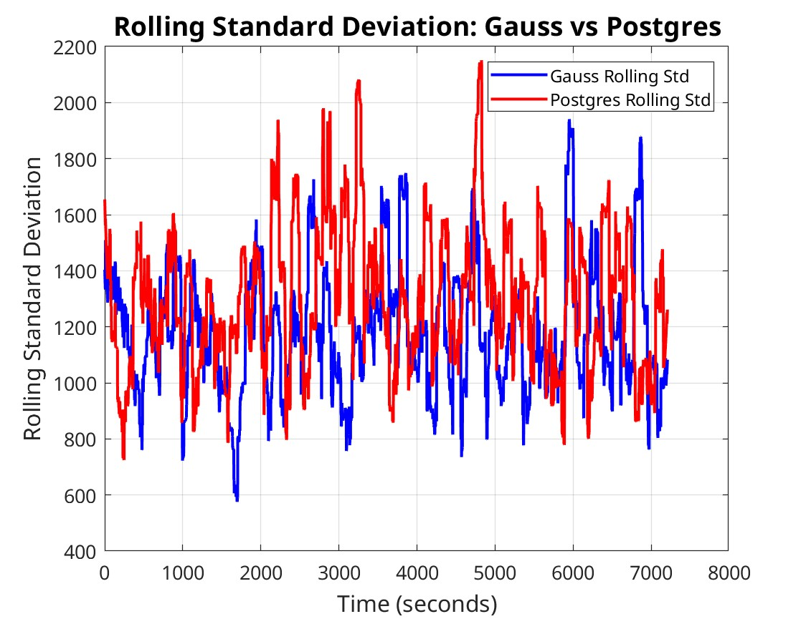
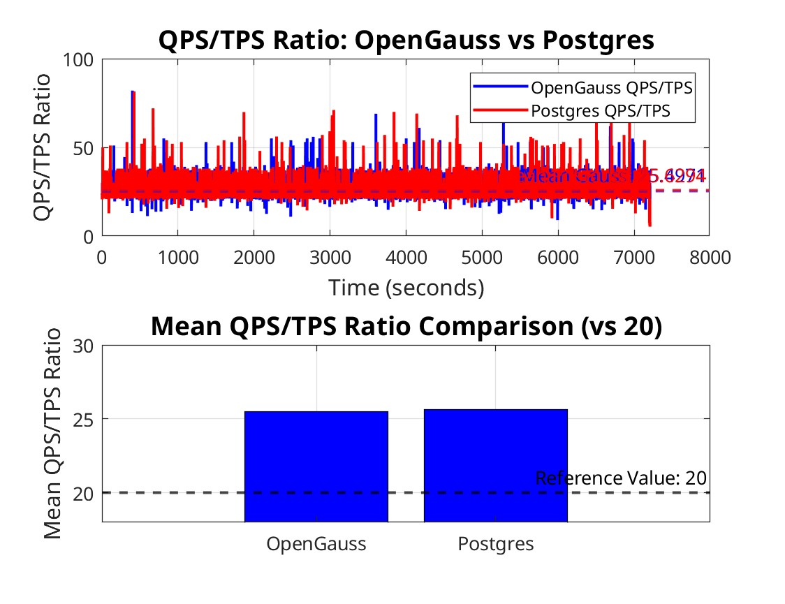
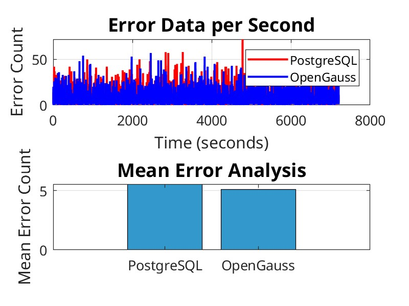

# Benchmarking-openGauss-Against-PostgreSQL-A-Comparative-Analysis


## Total Conclusion

- **OpenGauss is query-wise slow on my computer with default configeration compared to postgresSQL:latest (Click [here](#basic-experiments) to get the detail)**
- **OpenGauss has a potential to have a huge advantage on QPS under the situation of pretty high**
  **concurrency(Click [here](#result(additional-test-on-sysbench)) and [here](#basic-experiment-on-sysbench) to get the detail)**
- **OpenGuass can relatively keep a low value of QPS/TPS under situation of high concurrency compared**
  **to postgres:latest(Click [here](#result(additional-test-on-sysbench)) and [here](#result(pressure-test)) to get the detail)**
- **OpenGauss has a potential to keep error rate relatively low compared to postgres:latest under situtaion of high concurrency.(Click [here](#result(pressure-test)) to get the detail)**

## DATASET and Testbench

DATABSET :https://www.kaggle.com/datasets/wyattowalsh/basketball/data

TestBench :sysbench

## Timer Standard

In the part of Basic Experiments, I used 

```postgresql
\timing
```

In the sysBench part, I just use the data offered by the testbench.

## DATABASE(implemented by docker)

### Pull Images

- Postgres:latest

  ```shell
  docker pull postgres
  ```

- Postgres:9.2

  ```shell
  docker pull postgres:9.2
  ```

- OpenGauss:3.1.1

  ```shell
  docker pull docker.1panel.live/enmotech/opengauss:3.1.1
  ```

### Create Docker

Here is a sample 

```dockerfile
docker run --name project3-opengauss --privileged=true \
	-d -e GS_PASSWORD=<!!!your db password!!!> \
	-v <!!!persist directory!!!>:/var/lib/opengauss -u root \
	-p 15432:5432 \
	docker.1panel.live/enmotech/opengauss:3.1.1
```

You just need to adjust some parameters if you like.

## Basic Experiments

### Brief Introduction(Reproductive Step)

We use the sysbench to test the databases

- postgres:latest
- OpenGauss:3.1.1

We did experiments on 

- DATABASE CREATE/DROP

  ```postgresql
  CREATE DATABASE dbms;
  ```

  DATABASE DROP 

  ```postgresql
  DROP DATABASE dbms;
  ```

- DATA INSERT

  [DATA INSERT](./src/import.sql)

- RETRIEVAL UPDATE/SELECT

  [RETRIEVAL UPDATE](./src/actual_retrieval_update.sql)

  RETRIEVAL SELECT

  ```postgresql
  SELECT * FROM play_by_play WHERE player1_name = 'Kevin Love';
  ```

- BI-CONDITIONAL SELECT

  BI-CONDITIONAL SELECT

  ```postgresql
  SELECT * FROM play_by_play WHERE player1_name = 'Kevin Love' AND game_id = '0021600215'
  ```

- Large-scale Insert From other Table

  [Large-scale Insert](./src/actual_large_scale_insert.sql)

### Result


### Analyze

Blue lines are the time consumption of postgres:latest, Green lines are of OpenGauss.

**OpenGauss is query-wise slow on my computer with default configeration compared to postgresSQL:latest**

When I get this project, the first thing comes to my mind about the ability of a database is how fast can it
do some basic operations like CREATE DATABASE, INSERT, SELECT... I mean, what is the operation
time.
So I did some test on basic operations based on the NBA database. The result indeed shocked me a
lot.

## Basic Experiment on sysbench

### Brief Introduction(Reproductive Step)

We use the sysbench to test the databases

- postgres:latest
- postgres:9.2
- OpenGauss:3.1.1

**The first two tests used default parameter in config file, and the next three I modified the important config parameters to be the same.**

I made five tests here in total

- [Test on sysbench on the default setting of database, mono-user](./src/Mono_User_bench.sh)
- [Test on sysbench on the default setting of database, 50-user](./src/50_User_bench.sh)
- [Test on sysbench on the unified loose setting of database, mono-user](./src/Mono_User_bench_unified.sh)
- [Test on sysbench on the unified loose setting of database, 50-user](./src/50_User_bench_unified.sh)
- [Test on sysbench on the unified loose setting of database, 100-user](./src/100_User_bench_unified.sh)

### Result $(1,2)$



### Analyze $(1,2)$

**postgres:9.2 has similar performance to postgres:latest,OpenGauss is indeed SLOW under low concurrency.**

What’s more, because these two tests actually did not put too much pressure on the database, so we can
see that QPS/TPS is optimally $20$.
After these findings, I have another guess, is it because the difference in default configuration that
makes OpenGauss loss so much? With this thought, I entered the dockers and unified all the important
configuration about resource limitations. Then we did three tests.

### Result $(3,5)$



### Analyze $(3,5)$

There are two parts of the result, **one is although this time there is noticable difference between**
**postgres:latest and postgres:9.2, when it is dealing with small concurrent like $1$ and $50$,**
**openGauss is still really SLOW**

But there is another new part of the result which gives me hope to find the advantage of OpenGauss.
We can notice that

-  Although OpenGauss is the slowest in all three tests, **but its relative performance actually**
  **improved with more concurrency**, which means that OpenGauss might be really good at handle
  large concurrency.
-  In the former two tests, we might notice that QPS/TPS is always a constant 20 reveal
  the optimal solution to the sysbench, but now, **all the numbers are starts to get over 20,**
  **luckily postgres explodes much faster than OpenGauss, which indicate that the optimizer in**
  **OpenGauss can undergo more pressure with high concurrency and make the better optimaize decision.**

## Additional test on sysbench && Pressure Test

### Brief Introduction(Reproductive Step)

We use the sysbench to test the databases

- postgres:latest
- postgres:9.2
- OpenGauss:3.1.1

And the code is [Here](./src/night_test_all.sh)

### Result(Additional test on sysbench)







### Analyze(Additional test on sysbench)

From the graph we can notice that our two guess about **QPS** and **QPS/TPS** on the last test are
verified. In the graph, it is clear that when concurrency is low, Postgres:latest can do more query
than OpenGauss, but **when threads number goes high, we can find that at thread = 600, we**
**have OpenGauss can do twice number of query per second compared to postgres:latest, and**
**also we can find that QPS/TPS expand faster for postgres:latest. All of these data is powerful**
**evidence yelling that OpenGauss does better under high concurrency.**

### Result(Pressure Test)










### Analyze(Pressure Test)

And it is just like the result of the last problem, we can not see significant different in QPS because it is
in some kind of edge. But we can notice that **The deviation of QPS of OpenGauss is smaller than**
**Postgres and also it has smaller QPS/TPS**, these two thing that although it is not in 600 threads,
but OpenGauss is going to take over Postgres on speed and stability. Also we can notice that **the error**
**of OpenGauss is smaller**, which is also a criteria to say that openGauss has better performance on high
concurrency.
**Unfortunately, limited on the equipment and time, I can not have the chance to do more**
**extreme test on postgres and OpenGauss, 600 threads is obviously not an extremely high**
**concurrency. But from our tests, we can indicate that openGauss can have excellent High**
**concurrent performance compared to OpenGauss, because there has already been strong**
**evidence and trend for that.**

## Email

If you have any question about the strategy or the result, please tell me [HERE](mailto:Jingqi.sun@outlook.com)

