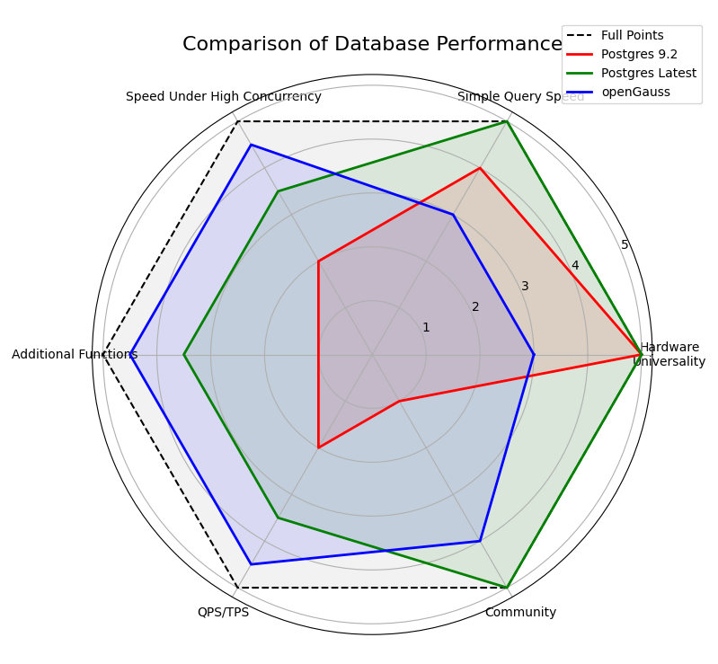

# Benchmarking-openGauss-Against-PostgreSQL-A-Comparative-Analysis


## DATASET and Testbench
DATABSET :https://www.kaggle.com/datasets/wyattowalsh/basketball/data

TestBench :sysbench

## Timer Standard

In the part of Basic Experiments, I used 

```postgresql
\timing
```

In the sysBench part, I just use the data offered by the testbench.

## DATABASE(implemented by docker)

### Pull Images

- Postgres:latest

  ```shell
  docker pull postgres
  ```

- Postgres:9.2

  ```shell
  docker pull postgres:9.2
  ```

- OpenGauss:3.1.1

  ```shell
  docker pull docker.1panel.live/enmotech/opengauss:3.1.1
  ```

### Create Docker

Here is a sample 

```dockerfile
docker run --name project3-opengauss --privileged=true \
	-d -e GS_PASSWORD=<!!!your db password!!!> \
	-v <!!!persist directory!!!>:/var/lib/opengauss -u root \
	-p 15432:5432 \
	docker.1panel.live/enmotech/opengauss:3.1.1
```

You just need to adjust some parameters if you like.

## Basic Experiments

### Brief Introduction

We did experiments on 

- DATABASE CREATE/DROP

  ```postgresql
  CREATE DATABASE dbms;
  ```

  DATABASE DROP 

  ```postgresql
  DROP DATABASE dbms;
  ```

- DATA INSERT

  [DATA INSERT](./src/import.sql)

- RETRIEVAL UPDATE/SELECT

  [RETRIEVAL UPDATE](./src/actual_retrieval_update.sql)

  RETRIEVAL SELECT

  ```postgresql
  SELECT * FROM play_by_play WHERE player1_name = 'Kevin Love';
  ```

- BI-CONDITIONAL SELECT

  BI-CONDITIONAL SELECT

  ```postgresql
  SELECT * FROM play_by_play WHERE player1_name = 'Kevin Love' AND game_id = '0021600215'
  ```

- Large-scale Insert From other Table

  [Large-scale Insert](./src/actual_large_scale_insert.sql)

### Result


### Analyze

Blue lines are the time consumption of postgres:latest, Green lines are of OpenGauss.

**OpenGauss is query-wise slow on my computer with default configeration compared to postgresSQL:latest**

When I get this project, the first thing comes to my mind about the ability of a database is how fast can it
do some basic operations like CREATE DATABASE, INSERT, SELECT... I mean, what is the operation
time.
So I did some test on basic operations based on the NBA database. The result indeed shocked me a
lot.

## Basic Experiment on sysbench

### Brief Introduction

We use the sysbench to test the databases

- postgres:latest
- postgres:9.2
- OpenGauss:3.1.1

The first two tests used default parameter in config file, and the next three I modified the important config parameters to be the same.

I made five tests here in total

- [Test on sysbench on the default setting of database, mono-user](./src/Mono_User_bench.sh)
- [Test on sysbench on the default setting of database, 50-user](./src/50_User_bench.sh)
- [Test on sysbench on the unified loose setting of database, mono-user](./src/Mono_User_bench_unified.sh)
- [Test on sysbench on the unified loose setting of database, 50-user](./src/50_User_bench_unified.sh)
- [Test on sysbench on the unified loose setting of database, 100-user](./src/100_User_bench_unified.sh)

### Result

